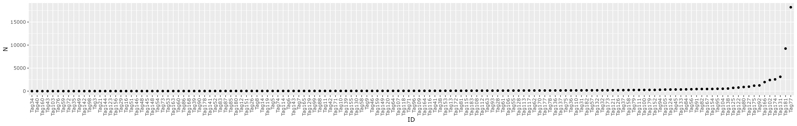
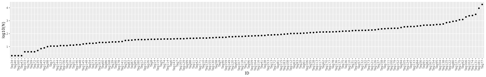

# PIPseek-validation

## Retrieve files from Google Drive
```bash
module load rclone
rclone copy --drive-shared-with-me "dtigoogledrive:/DR_cellranger test/" .
```

## Run basic cellranger

 > allseqs.txt

```R

fastq='DR-9163_25_S25_L001_R2_001.fastq.gz'
command <- paste0('zcat ', fastq, " | awk 'NR%4==2'")
dat <- fread(cmd=command, header=FALSE)
setnames(dat, 'read')
dat <- dat[, .N, by=read]


# 65323 total reads
# 8031 unique reads
# 7968 unique reads without any N
dat <- dat[! read %like% 'N']
gRNA_pattern <- 'GTTG[ACTG]{20}GTTT'
dat[read %like% gRNA_pattern]   # 5930 guides match pattern

# How common are indels within the guide?
nrow(dat[read %like% 'GTTG[ACTG]{18}GTTT'])     # 5
nrow(dat[read %like% 'GTTG[ACTG]{19}GTTT'])     # 64
nrow(dat[read %like% 'GTTG[ACTG]{21}GTTT'])     # 26
nrow(dat[read %like% 'GTTG[ACTG]{22}GTTT'])     # 9

# Subset to only include 5930 reads that match expected pattern 
dat <- dat[read %like% gRNA_pattern] 

# Extract gRNA plus flanking region
dat[, extracted := regmatches(read, regexpr(gRNA_pattern, read))]

# Extract gRNA alone
dat[, gRNA := substr(extracted, 5,24)]

# Get count distribution
dat[, list('N'=sum(N)), by=gRNA][order(N)]

# Load in gRNA csv
expected_gRNA <- fread('adt-tags-183sgRNAsequences-Tian2019.csv', header=FALSE)
setnames(expected_gRNA, c('gRNA', 'ID','class'))

# Merge 

dat <- merge(dat, expected_gRNA, by='gRNA', all=TRUE)
# 1963 gRNA that are not in expected list of guides

# Subset to 3967 guides that are present AND expected
dat <- dat[!is.na(ID)][!is.na(extracted)]

# Calculate representation per sequence
dat <- dat[, list('N'=sum(N)), by=list(gRNA, ID, class)][order(N)]

# Set in incrementing order of abundance
IDorder <- dat$ID
dat[, ID := factor(ID, levels=IDorder)]

# Export on log10 scale
g <- ggplot(dat[N>1], aes(x=ID, y=log10(N))) + geom_point() +
theme(axis.text.x = element_text(angle = 90, vjust = 0.5, hjust=1)) 
ggsave(g, file='gRNA_distribution_log10.png', width=50, height=8, units='cm')

# Export linear scale
g <- ggplot(dat[N>1], aes(x=ID, y=N)) + geom_point() +
theme(axis.text.x = element_text(angle = 90, vjust = 0.5, hjust=1)) 
ggsave(g, file='gRNA_distribution_linear.png', width=50, height=8, units='cm')
```



